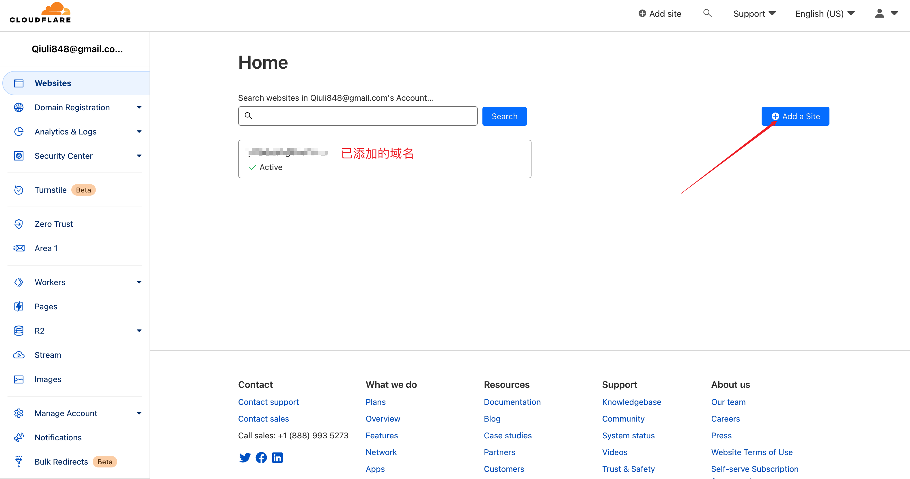
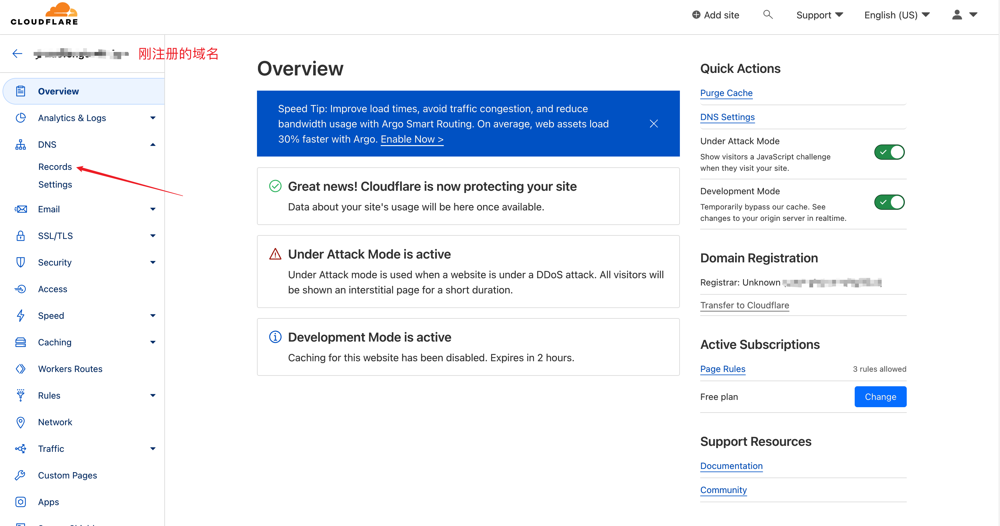
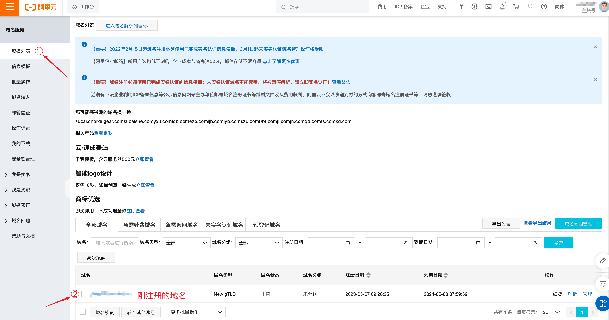
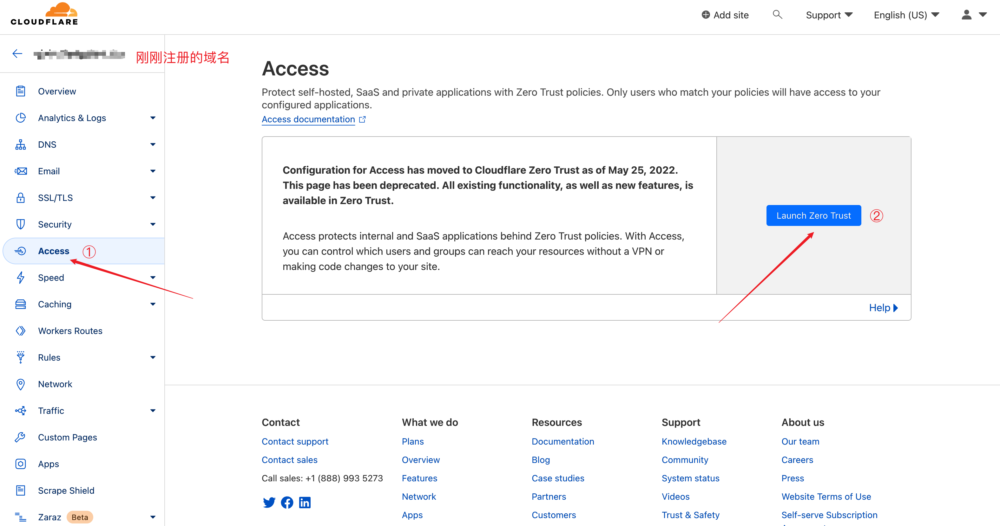
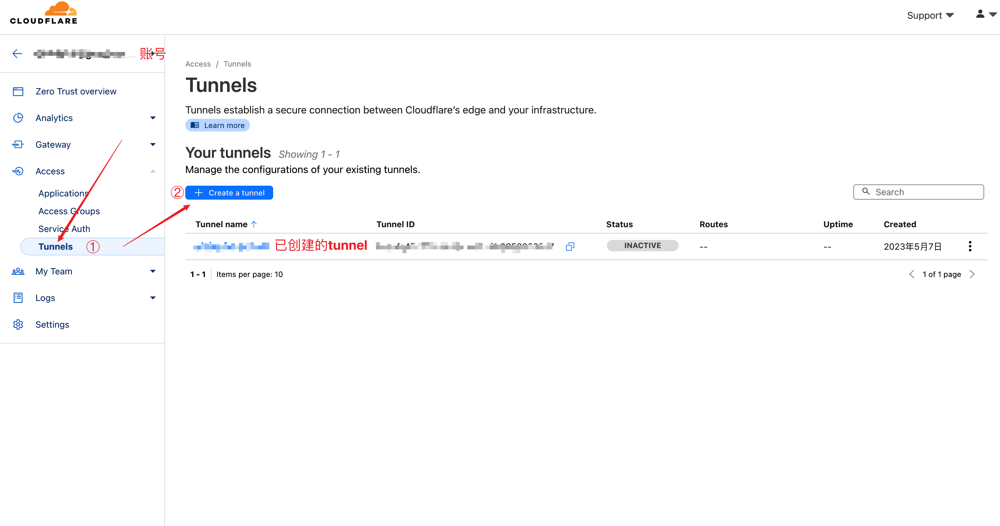
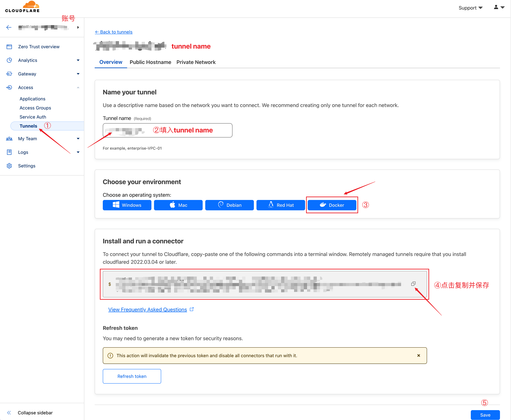
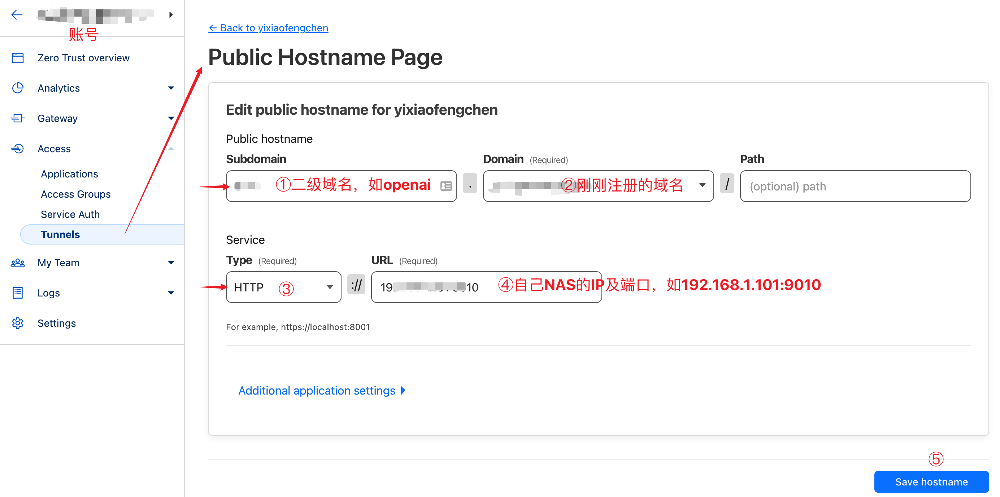

# GPT 学术优化 (ChatGPT Academic) 免翻墙教程


> 本文是针对[elphen-wang/chatgpt_walfree](https://github.com/elphen-wang/chatgpt_wallfree)的具体实践操作

> ChatGPT无疑是提高生产力的重要工具，也可以是科研的好帮手，但是它最大的不便之处包括但不限于以下两点：
（1）**<font color=red>不免费</font>**。即便付费，缴费也有一定的门槛，而且价格不便宜。
（2）**<font color=red>需要科学上网</font>**。即通俗说法中的“翻墙”。虽然，搞科研的人使用科学上网并不罕见，但是部署到境内个人设备，总归有被检测到的风险。
<font color=blue>本教程旨在缓解或解决以上两点痛点需求，适合个人和课题组生产环境。</font>
  
**本教程参考了以下高手（大佬）的智慧成果，在此先respect和鸣谢！如果喜欢他们项目和本教程，请不吝分别给一个Star，谢谢！**
+ [binary-husky的《gpt_academic》](https://github.com/binary-husky/gpt_academic), 本教程就是解决就是它需翻墙的问题。
+ [x-dr的《chatgptProxyAPI》](https://github.com/x-dr/chatgptProxyAPI)，用于搭建OpenAI的API中转代理，免翻墙的关键一步。
+ [坚叔Evan的《极空间无公网IP搭建Cloudflared免费隧道内网穿透，部署docker教程》](https://post.smzdm.com/p/ao9vdw8n/)，用于绑定自申请的（阿里云）域名到cloudflare和在自己私有云部署ChatGPT Academic。
+ [六岁小少年的《2023年稳定可用的谷歌镜像站无需翻墙》](https://www.jkxuexi.com/resources/99.html)，用于替换ChatGPT Academic联网功能使用谷歌搜索。

以下各环节中具体操作步骤，可参见其中的链接，本教程就不搬运赘述，从而减少了ta们成果的热度。

## 一、在阿里云上购买域名并绑定到Cloudflare (非必须)
> 详细的操作步骤可参见**坚叔Evan**的[坚叔Evan的《极空间无公网IP搭建Cloudflared免费隧道内网穿透，部署docker教程》](https://post.smzdm.com/p/ao9vdw8n/)，本人已经走过一遍，无问题。不过，值得注意的是，他教程的初心是内网穿透个人私有云的docker。它可把局域网内的内网转发到外网上，免去一般需公网ip的制约。

> 购买域名时，建议购买首年8元、10年188元的套餐，比较划算。毕竟，续约比较贵。

> 但这一步并不是必须的，也不是必须在阿里云上购买域名。因为，本教程下一步中将说明，使用cloudflare自带域名亦可实现公网访问。

### 1. 阿里云注册域名
- [阿里云](https://cn.aliyun.com/) → 产品 → 域名与网站Domains
- 自建域名并查询
- 购买域名时，建议购买首年8元、10年188元的套餐
- 按照指引一步一步实名，注意必须完成实名认证

### 2. 注册Cloudflare账号
- 我们登录Cloudflared注册一个账号并登录，官网链接：[Cloudflare](https://www.cloudflare-cn.com/)
- 站点添加刚才注册的阿里云网站
- 选择Free，继续下一步
- 复制保存好两个Cloudflare名称服务器
- 设置好后可以进入该站点，服务器可以在DNS设置中找到
- 回到刚才阿里云域名管理，左侧域名列表，点击域名进入
- 修改dns，把刚才复制的2个Cloudflare填到这里，确定保存
- 然后回到Cloudflare，点完成并开始使用

### 3. 建立Tunnel
- 返回首页，点击Access，启动Zero Trust
- 点击Access下的Tunnels，点Create a tunnel
- 首次使用会弹出付费方案的设置，选择Free，点Select plan，选择0元购买，并设置支付方式（信用卡），保存即可
- 回到Create a tunnel，输入喜欢的名称，如yixiaofengchen
- 设置该tunnel的Configure，选择environment为Docker，并复制下面那串代码（Token）并保存
- 继续设置Public Hostname，Subdomain填openai，domain填刚刚注册的域名；设置Service，Type选择HTTP，URL填写自己NAS的IP及想要映射的端口（如192.168.1.101:9010），然后点Save hostname

## 二、搭建OpenAI的API中转代理
OpenAI及其API在大陆境内是被墙状态，目前在境内使用它们一般是科学上网或中转或[反向代理](https://github.com/youminxue/chatgpt_plus_proxy_website)。ChatGPT Academic本身默认使用的是OpenAI原生API链接，但这不妨碍我们对此略作修改，使其走中转代理。本教程参考的教程是x-dr的[《chatgptProxyAPI》](https://github.com/x-dr/chatgptProxyAPI)，主要是[《利用Cloudflare Worker中转api.openai.com》](https://github.com/x-dr/chatgptProxyAPI/blob/main/docs/cloudflare_workers.md)。但是，由于cloudflare的workers.dev被墙或被污染，如果不使用自己的域名，那么可以尝试[使用cloudflare的Pages进行中转](https://github.com/x-dr/chatgptProxyAPI/blob/main/docs/cloudflare_proxy_pages.md)（未测试）。

这里建议在```Tiggers->Add Coustom Domain->Domain```设置二级域名，如```openai.mydomain.website```，这里一级域名```mydomain.website```可以不浪费，用于其他用途。这时，就可以用自己的域名``` https://openai.mydomain.website/v1/chat/completions```代替官方的```https://api.openai.com/v1/chat/completions ```。根据[x-dr的教程](https://github.com/x-dr/chatgptProxyAPI/blob/main/docs/cloudflare_workers.md)介绍可可知：**由于 Cloudflare 有每天免费 10 万次的请求额度，所以轻度使用基本是零成本的**。

以上步骤完成之后，可以在浏览器输入自己的域名测试一下中转API是否生效，当出现以下页面提示之后，即这一步教程就大功告成：
``` json
{
    "error": {
        "message": "You didn't provide an API key. You need to provide your API key in an Authorization header using Bearer auth (i.e. Authorization: Bearer YOUR_KEY), or as the password field (with blank username) if you're accessing the API from your browser and are prompted for a username and password. You can obtain an API key from https://platform.openai.com/account/api-keys.",
        "type": "invalid_request_error",
        "param": null,
        "code": null
    }
}
```
经测试，中转速度是可以忍受的，基本无影响。

## 三、下载ChatGPT Academic，略修改若干需翻墙的设置
ChatGPT Academic有多种安装方式，本人使用的是Docker安装方式。这里主要介绍的也是这种方式，因为这种方式是后期最懒人的方式，也是方便科研组环境使用最好的方式。

ChatGPT Academic具体的安装教程可参见[官方网站](https://github.com/binary-husky/gpt_academic)，下载部分无需赘述。以下快进到docker安装方式。

``` bash {.line-numbers}
git clone https://github.com/binary-husky/chatgpt_academic.git
cd chatgpt_academic
# 复制config.py成config_private.py
# 建议config_private.py在别的文件夹保存一遍，方便以后ChatGPT Academic更新要作二次配置，直接复制它进入更新的版本就好
cp config.py config_private.py
# 用任意文本编辑器编辑 config_private.py, 配置 “API_KEY” (sk-开头的字符串码), “WEB_PORT” (例如30532) ，"AUTHENTICATION"可设置用户登录，API_URL_REDIRECT设置API中转代理。这些如何设置，config_private.py有具体的注释说明。
# 用任意文本编辑器编辑 requirements.txt,在尾后补一个库函数 pdfminer, 否则arxiv下载和分析功能可能不能正常使用。
# 用任意文本编辑器编辑 Dockerfile， 在 RUN pip3 install -r requirements.txt后补一句RUN pip3 install --upgrade gradio， 不然有可能报gradio低的错误
cd crazy_functions
# 用任意文本编辑器编辑联网的ChatGPT.py
# 将谷歌引擎替换，即将https://www.google.com替换为https://note.cm或其他谷歌镜像或者其他搜索引擎。
cd ..
# 安装
docker build -t gpt-academic .
# 测试是否可用，关闭后docker自动删除该镜像
docker run --rm -it --net=host gpt-academic
# 正式部署
docker run -d -p 30532:30532 --name gpt-academic gpt-academic
```
以上步骤完成之后，在docker所在设备中使用浏览器访问```http://localhost:30532```或```http://127.0.0.1:30532```或```http://设备ip:30532```，测试ChatGPT Academic正常使用的话，基本就大公告成。后续步骤就是更完美地在外网访问ChatGPT Academic而做的设置。

这里注意几点：
+ 一般课题组使用单位局域网固定ip，会选择把这个固定ip绑定在路由器上，这样这个ip经济性最高（如此，多个设备可共享一个固定ip）。在这种环境中，别忘记在该路由器中设置NAT服务，即端口映射；不在这种环境，忽略本点。
+ 需要使用ChatGPT+ChatGLM的，按binary-husky的说法，```需要对Docker熟悉 + 读懂Dockerfile + 电脑配置够强```，本人按照原教程指导遇到下面报错，懒得折腾了，故也就没有使用ChatGLM。
``` bash
Dockerfile+ChatGLM:26
--------------------
  24 |     RUN curl -sS https://bootstrap.pypa.io/get-pip.py | python3.8
  25 |     # 下载pytorch
  26 | >>> RUN $useProxyNetwork python3 -m pip install torch --extra-index-url https://download.pytorch.org/whl/cu113
  27 |     # 下载分支
  28 |     WORKDIR /gpt
--------------------
ERROR: failed to solve: process "/bin/sh -c $useProxyNetwork python3 -m pip install torch --extra-index-url https://download.pytorch.org/whl/cu113" did not complete successfully: exit code: 1
```
+ 本教程根据六岁小少年的[《2023年稳定可用的谷歌镜像站无需翻墙》](https://www.jkxuexi.com/resources/99.html)的指引，使用的谷歌镜像是[https://note.cm/](https://note.cm/)，速度可以，也可以被ChatGPT Academic使用。
+ ChatGPT Academic的```谷歌学术统合小助手```功能可以使用谷歌学术镜像，这也在六岁小少年的[《2023年稳定可用的谷歌镜像站无需翻墙》](https://www.jkxuexi.com/resources/99.html)找到导航大全。

至此，在个人和课题组生成环境中免翻墙使用ChatGPT Academic的教程就已完结。以下，是使得使用体验更加完美并可以使其外网访问。

## 四、内网穿透，外网访问ChatGPT Academic
如果有外网服务器且容量比较富裕的话，那么可以直接把ChatGPT Academic直接部署到外网服务器，免的设置内网穿透等一系列自寻烦恼的麻烦设置。本人阿里云配置使用的是最低配，且阿里云也有其他任务需求，而初心是想把ChatGPT Academic面向课题组使用，故放置在内网。

面对偶尔的外网访问需求，除了使用单位的VPN链接到内网服务器，也可以使用诸如ZeroTier等内网穿透软件。本教程主要介绍使用ZeroTier，可把外网设备器和内网设备加入同一ZeroTier虚拟局域网，即可实现内网穿透。具体步骤可以参见知乎用户我是阿蛮的[《Zerotier 搭建私有根服务器及创建虚拟局域网完整教程》](https://zhuanlan.zhihu.com/p/573746661)。注意这里是在公网建立一个ZeroTier根服务器，可极大提升内网穿透速度。

在上述环境中，如果开放ChatGPT Academic给别的单位课题组或者大众使用，可在公网服务器上安装nginx等网页服务器软件，实现内网ip转发。由于[阿里云每年有免费20个额度的SSL证书申请](http://www.wmsee.cn/news/4427.html)，也可以在nginx中实现https服务。当然，也可使用本教程第一步中的cloudflare的提到服务（即在内网服务器上部署cloudflared的docker的镜像）实现这一步，且还无需公网服务器及ip，但速度比阿里云较慢一些。

以下是nginx的配置https服务代码设置，供参考：
``` bash 
server {
        listen       443 ssl;
        #server_name  localhost;
        server_name gptac.mydomain.website; #自己申请的域名
        
        index index.html index.htm;
        # 以下两行是ssl的证书和密钥。
        ssl_certificate cert/xxxxxxxx_gptac.mydomain.website.pem; 
        ssl_certificate_key cert/xxxxxxxx_gptac.mydomain.website.key; 
        ssl_session_timeout 5m;
        ssl_ciphers ECDHE-RSA-AES128-GCM-SHA256:ECDHE:ECDH:AES:HIGH:!NULL:!aNULL:!MD5:!ADH:!RC4;
        #表示使用的加密套件的类型。
        #ssl_protocols TLSv1.1 TLSv1.2 TLSv1.3; #表示使用的TLS协议的类型，您需要自行评估是否配置TLSv1.1协议。
        #ssl_prefer_server_ciphers on;
        #error_page 497 301 =307 https://$host:$server_port$request_uri; ##如https为特殊端口时可使用此方式客户端访问http时自动为https
        
        location / {
            add_header Content-Security-Policy upgrade-insecure-requests;
            proxy_set_header  x-real-ip $remote_addr;
            proxy_set_header  host   $http_host;
            proxy_set_header X-Forwarded-For $proxy_add_x_forwarded_for;
            proxy_pass http://10.180.8.231:8444;
            proxy_http_version 1.1; # 以下三行不能省略，否则报 something connected error。
            proxy_set_header Upgrade $http_upgrade; #
            proxy_set_header Connection "upgrade"; #
            #修复退出登录重定向时这个报错：The plain HTTP request was sent to HTTPS port
            proxy_redirect http:// https://;
       }
       
    }
```

## 其他
+ 欢迎就本帖进行友好交流与讨论，共同促进技术开放与进步！
+ 貌似之前的ChatGPT Academic自动提供外网访问链接，现在的版本移除了这一功能，不知道是因为速度还是为了防止API key泄露的原因。不过，由于由于自动提供的链接不是很方便人类记忆，建议使用nginx等网页服务器或cloudflare服务转发内网到外网上去。
+ ChatGPT Academic之前介绍过[huggingface](https://huggingface.co)，可以省去部署ChatGPT Academic和翻墙烦恼。不知何故，binary-husky现在移除了这一部分介绍，但是huggingface目前仍然有人在持续更新ChatGPT Academic的部署。不过，huggingface的缺点是API key需要使用前输入一次；有的用户可能忘记看提示，没有复制一份space导致API key有泄露的风险。
+ 什么？没说怎么白嫖和怎么（低成本）获取API key码？
  + 白嫖ChatPGT，github有很多用户搭建了免费体验版网站，可自行搜索。但碍于经济性的原因，用爱发电不会持久，可能需要打一枪换一个阵地。大家可以找一些研究单位或大学搭建的面向公众的ChatGPT门户，可能比较持久，但应该比较少。
  + API key现在是收费模式，且注册和缴费有一点门槛或不便，但不妨碍“拼车上路”。我觉得这是最经济且门槛最低获取API key的方式。github中已经有一些用户已经发布拼车邀请，可自行搜索。
  + 如果有一个豪（土豪的“毫”）气且义气（愿意分享API key）的朋友，那么也就没有这些烦恼了。
## 闲聊
+ 已经发现的官网教程的bug已经在之前的部署教程中有所纠正和说明。
+ 实测发现，Dockerfile中默认的下载源（阿里云源镜像）对有些单位来说，速度不够快，大家可以根据自己情况做相应替换，以下列了一些国内常用镜像源（本人实测，清华源比阿里源要快一些）：
```
清华：https://pypi.tuna.tsinghua.edu.cn/simple
阿里云：http://mirrors.aliyun.com/pypi/simple/
中国科技大学 https://pypi.mirrors.ustc.edu.cn/simple/
豆瓣：http://pypi.douban.com/simple/
华为：https://repo.huaweicloud.com/repository/pypi/simple/
腾讯：http://mirrors.cloud.tencent.com/pypi/simple
网易：https://mirrors.163.com/pypi/simple/
...
```
<!--
## Star History 
<a name="star-history"></a>
<a href="https://github.com/elphen-wang/chatgpt_wallfree/stargazers">
        
</a> 
-->
